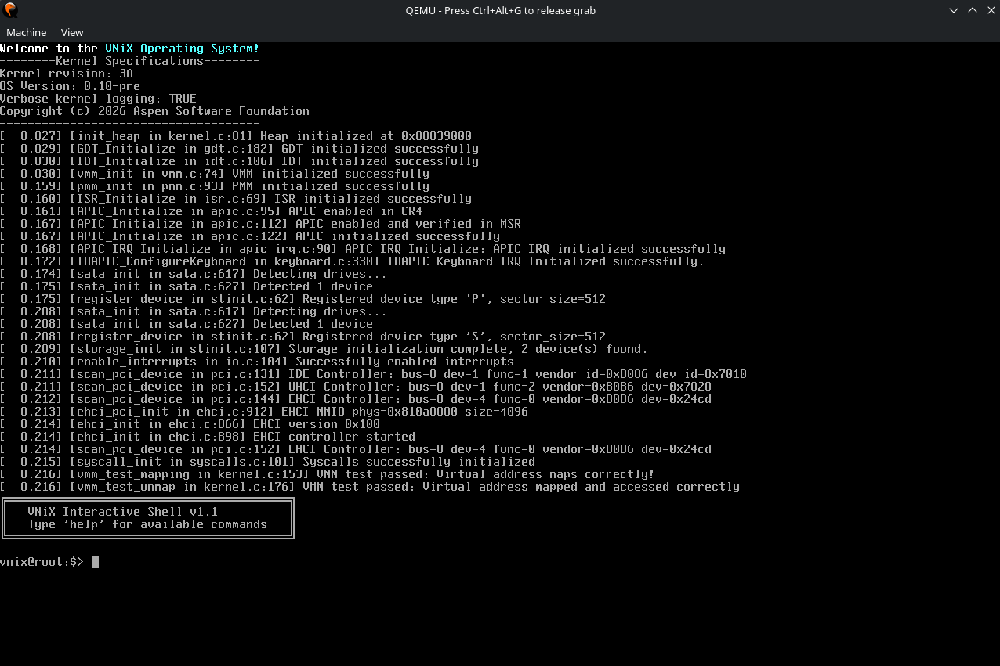

# VNiX Operating System (VNiX) 

Created by the Aspen Software Foundation, the VNiX Operating System is a new OS that's main goal is to run multiple executable types, such as Microsoft Windows's EXE file type, and Linux's ELF file type, 
therefore fixing the issue of having to dualboot Windows and Linux.

This operating system uses a modular build system made in the GNU Makefile Language, a fast and complex build language made specifically for large projects. More information can be found here: https://www.gnu.org/software/make/

Currently, the VNiX Operating System uses Flanterm for its terminal, as it is feature rich and includes better scrolling and color handling. 
VNiX also features RISCV32 program support, made by Dcraftbg. For more information about either one of these projects, visit the links at the bottom of this README.md.
This OS also features the Limine Bootloader, because of its extensive features and ease of use. I personally support its goals and achievements, which is why i've included it in this project.

---

## Building the OS

To build this OS, simply run the command below in the project's root directory:
```
make
```
The required dependencies are as follows:

- Make
- GCC Toolchain
- QEMU-Full
- Clang
- Parted

Note: The method of installing these packages may differ by distribution and operating system. Please refer to the documentation for your distribution and/or OS.

---



A picture of VNiX post-startup, version 0.10-pre
---
## Directory Structure:

This is the average root directory for VNiX on the user side

  ```
root-dir:
│   ├── 01
│   │   └── Introduction
│   ├── API-ABI
│   │   └── API-Info
│   ├── Development
│   │   └── EXE-Support
│   ├── Error-Codes
│   │   └── placeholder
│   └── Other
│       └── Gaming
├── arch
│   └── x86_64
│       ├── gdt.c
│       ├── idt.c
│       ├── includes
│       │   ├── gdt.h
│       │   ├── idt.h
│       │   ├── io.h
│       │   └── isr.h
│       ├── io.c
│       ├── isr.c
│       ├── isrs_gen.c
│       └── isr_stubs.asm
├── boot
│   ├── Assets
│   │   ├── limine.conf
│   │   ├── ovmf
│   │   │   └── OVMF.fd
│   │   ├── screenshot.png
│   │   └── wallpaper4k.png
│   ├── BOOTX64.EFI
│   ├── limine-bios-hdd.h
│   ├── limine.c
│   └── limine.h
├── CHANGES
├── CONTRIBUTORS
├── drivers
│   ├── emul
│   │   └── rv_vm.h
│   │       ├── LICENSE.md
│   │       └── rv_vm.h
│   ├── hci
│   │   ├── ehci.c
│   │   └── includes
│   │       └── ehci.h
│   ├── pci
│   │   ├── includes
│   │   │   └── pci.h
│   │   └── pci.c
│   └── pic
│       ├── apic
│       │   ├── apic.c
│       │   └── apic_irq.c
│       ├── includes
│       │   ├── apic
│       │   │   ├── apic.h
│       │   │   └── apic_irq.h
│       │   ├── pic.h
│       │   └── pic_irq.h
│       ├── pic.c
│       └── pic_irq.c
├── fs
│   └── filesystem.h
├── kernel
│   ├── kernel.c
│   ├── shell
│   │   ├── includes
│   │   │   ├── keyboard.h
│   │   │   ├── keyboard_macros.h
│   │   │   └── shell.h
│   │   ├── keyboard.c
│   │   └── shell.c
│   ├── storage
│   │   ├── ata.c
│   │   ├── atapi.c
│   │   ├── includes
│   │   │   ├── ata.h
│   │   │   ├── atapi.h
│   │   │   ├── sata.h
│   │   │   ├── scsi.h
│   │   │   ├── stinit.h
│   │   │   └── storage.h
│   │   ├── sata.c
│   │   ├── stinit.c
│   │   └── storage.c
│   ├── system
│   │   ├── includes
│   │   │   ├── segment.h
│   │   │   └── system.h
│   │   └── sched.c
│   ├── terminal
│   │   └── src
│   │       ├── flanterm_backends
│   │       │   ├── fb.c
│   │       │   ├── fb.h
│   │       │   └── fb_private.h
│   │       ├── flanterm.c
│   │       ├── flanterm.h
│   │       └── flanterm_private.h
│   ├── time
│   │   ├── includes
│   │   │   ├── time.h
│   │   │   └── tsc.h
│   │   ├── time.c
│   │   └── tsc.c
│   └── vnix
│       └── PLACEHOLDER
├── klibc
│   ├── assert.c
│   ├── includes
│   │   ├── assert.h
│   │   ├── ctype.h
│   │   ├── errno.h
│   │   ├── limits.h
│   │   ├── signal.h
│   │   ├── stdarg.h
│   │   ├── stdbool.h
│   │   ├── stddef.h
│   │   ├── stdint.h
│   │   ├── stdio.h
│   │   ├── stdlib.h
│   │   ├── string.h
│   │   └── sys
│   │       └── types.h
│   ├── limits.c
│   ├── stdio.c
│   ├── stdlib.c
│   └── string.c
├── linker.ld
├── Makefile
├── mm
│   ├── heapalloc
│   │   ├── tlsf.c
│   │   └── tlsf.h
│   ├── includes
│   │   ├── pmm.h
│   │   └── vmm.h
│   ├── pmm.c
│   └── vmm.c
├── README.md
└── tools
    ├── includes
    │   ├── endian.h
    │   ├── log-info.h
    │   ├── math.h
    │   ├── pit.h
    │   ├── printk.h
    │   ├── serial.h
    │   └── util.h
    ├── log-info.c
    ├── math.c
    ├── pit.c
    └── serial.c

```
---

## License

Most of this project is licensed and shipped under GPLv2 as seen in the LICENSE file, but some code snippets/files may be subject to different licenses. 
Please refer to the file contents and the disclaimer at the top of the file for more information.

---
## External project links
          
rv_vm.h: https://codeberg.org/Dcraftbg/rv_vm.h
